Combine Lip Sync AI and Face Restoration AI to get ultra high quality videos.

[Demo Video](https://www.youtube.com/watch?v=jArkTgAMA4g)  

Projects referred:
1. https://github.com/Rudrabha/Wav2Lip
2. https://github.com/TencentARC/GFPGAN

## 项目说明
  这是一个利用Wav2lip生成视频和音频口型同步，然后利用GFP-GAN进行超分提升画质的项目，主要流程如下

  

将视频文件放入./inputs/项目文件名/source_video
 
将音频文件放入./inputs/项目文件名/source_video
 
然后执行
~~~
python.exe run.py
~~~

 